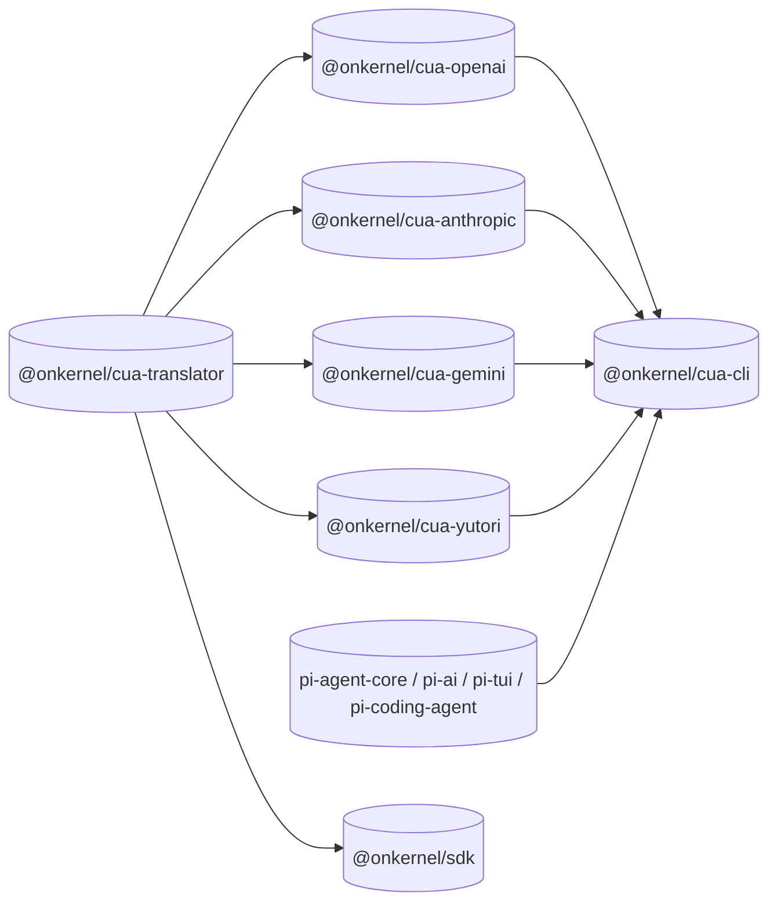

# cua

A computer-use CLI for agents (and TUI for humans) built on [pi-agent](https://github.com/earendil-works/pi/tree/main/packages/agent). 

```bash
cua "go to news.ycombinator.com and tell me the top 3 story titles"
```

`cua` provisions a [Kernel cloud browser](https://kernel.sh/), turns the model's computer-use tool calls into real mouse/keyboard/scroll/screenshot actions, and streams the result back to your terminal.

---

## Why this exists

Every frontier model now ships its own first-party "computer use" tool:

- **OpenAI gpt-5.5**: a built-in `computer` tool that emits actions like
  `{type:"click", x, y}`, `{type:"scroll", x, y, scroll_x, scroll_y}`,
  `{type:"keypress", keys:[...]}`, …
- **Anthropic claude-opus-4-7**: a built-in `computer_20251124` tool that
  emits `{action:"left_click", coordinate:[x, y]}`,
  `{action:"scroll", scroll_direction, scroll_amount}`, …
- **Google gemini-2.5-pro / gemini-3.x**: a set of predefined
  computer-use functions (`click_at`, `type_text_at`, `scroll_at`,
  `navigate`, `go_back`, …) with 0-1000 normalized coordinates.
- **Yutori Navigator n1 / n1.5**: OpenAI-compatible `chat.completions`
  responses with built-in browser action `tool_calls` like `left_click`,
  `goto_url`, `type`, and `scroll` in 0-1000 normalized coordinates.

All of them expect you to:

1. Run a real browser somewhere (locally is annoying, on a server is hard).
2. Translate every action into an actual SDK call against that browser.
3. Capture a fresh screenshot after each action and feed it back to the model so it can verify what happened and plan the next step.
4. Keep doing this in a loop until the task is done.

`cua` does all of this for you. The repo is structured as several focused npm packages so the per-provider plumbing is also reusable outside of this binary (e.g. by agents of your own spun up via [`kernel/cli`](https://github.com/kernel/cli) templates).

---

## Workspace

```
packages/
├── ai/               # @onkernel/cua-ai           - CUA model catalog + tool schemas + provider adapters (on npm)
├── agent/            # @onkernel/cua-agent        - CuaAgent/CuaAgentHarness Kernel-browser execution loop (on npm)
├── cua-translator/   # @onkernel/cua-translator   - shared SDK types + translator + browser-session
├── cua-openai/       # @onkernel/cua-openai       - gpt-* (batch_computer_actions + computer_use_extra)
├── cua-anthropic/    # @onkernel/cua-anthropic    - claude-* (computer_20251124 + batch_computer_actions + onPayload)
├── cua-gemini/       # @onkernel/cua-gemini       - gemini-* (predefined functions + batch_computer_actions)
├── cua-yutori/       # @onkernel/cua-yutori       - n1* (Navigator browser actions)
└── cua-cli/          # @onkernel/cua-cli          - the CLI; depends on the cua-* providers above
```

**Building your own agent? Start here:** [`packages/ai`](packages/ai)
(`@onkernel/cua-ai`) is the model layer — the curated computer-use model
catalog, canonical tool schemas, and per-provider adapters on top of pi-ai.
[`packages/agent`](packages/agent) (`@onkernel/cua-agent`) is the execution
layer — `CuaAgent`/`CuaAgentHarness` run those tool calls against a Kernel
browser. Both are published to npm. The `cua-*` packages below back the `cua`
CLI.



| Package                                               | What it ships                                                                                                                            |
| ----------------------------------------------------- | ---------------------------------------------------------------------------------------------------------------------------------------- |
| [`@onkernel/cua-ai`](packages/ai)                     | Computer-use model catalog (`getCuaModel`/`listCuaModels`), canonical CUA tool schemas, and provider adapters/runtime specs built on pi-ai. On npm. |
| [`@onkernel/cua-agent`](packages/agent)               | `CuaAgent`/`CuaAgentHarness` classes that execute cua-ai tool calls against a Kernel browser, screenshot loop included. On npm.          |
| [`@onkernel/cua-translator`](packages/cua-translator) | Provider-agnostic `ComputerTranslator`, key/scroll/drag math, `goto`/`back`/`forward`/`url` builders, browser-session helper.            |
| [`@onkernel/cua-openai`](packages/cua-openai)         | `batch_computer_actions` + `computer_use_extra` AgentTools and JSON Schemas for OpenAI computer-use models.                              |
| [`@onkernel/cua-anthropic`](packages/cua-anthropic)   | `computer` (built-in `computer_20251124`) + `batch_computer_actions` AgentTools, beta-header stream wrapper, payload hook.               |
| [`@onkernel/cua-gemini`](packages/cua-gemini)         | 13 per-action AgentTools matching Gemini's predefined computer-use functions, plus `batch_computer_actions`. Coordinate denormalization. |
| [`@onkernel/cua-yutori`](packages/cua-yutori)         | AgentTools matching Yutori Navigator browser actions, with outbound payload filtering so Yutori uses its built-in action set.             |
| [`@onkernel/cua-cli`](packages/cua-cli)               | The `cua` binary: argv parsing, config, sessions, skills, JSONL output, pi-tui front-end.                                                |

---

## Quickstart

```bash
git clone https://github.com/kernel/cua
cd cua
npm install
npm run build

# put `cua` on PATH (creates ~/.local/bin/cua → bin/cua):
mkdir -p ~/.local/bin
ln -s "$(pwd)/bin/cua" ~/.local/bin/cua
# make sure ~/.local/bin is on $PATH (most distros already do)

# either set up a config file...
cua config init                              # interactive: profile name + API keys

# ...or rely on env vars
export OPENAI_API_KEY=sk-...                 # for gpt-5.5
export ANTHROPIC_API_KEY=sk-ant-...          # for claude-opus-4-7
export GOOGLE_API_KEY=...                    # for gemini-3-flash-preview
export YUTORI_API_KEY=yt_...                 # for n1.5-latest
export KERNEL_API_KEY=sk_...                 # always required

# single-shot
cua -p "Open https://news.ycombinator.com and tell me the top story"

# list supported model ids
cua models

# Claude
cua -p --model claude-opus-4-7 "Same prompt"

# Gemini 3 Flash (built-in computer use)
cua -p --model gemini-3-flash-preview "Same prompt"

# Yutori Navigator
cua -p --model n1.5-latest "Same prompt"

# interactive TUI (default mode)
cua
cua "summarize https://news.ycombinator.com"

# agent-friendly subcommands (one-shot, see "Agent-friendly subcommands" below
# for the full surface and named-session workflow)
cua open https://github.com/login
cua click "Sign in"
cua url
cua screenshot --out shot.png

# resume the most recent session for this cwd (fresh browser, prior context)
cua -c "now click on the second result"

# JSONL events for scripting
cua -p -o jsonl "open example.com and tell me the heading"
```

---

## How it works

1. **Agent loop** — `pi-agent-core`'s `Agent` owns the message
   transcript, tool execution, and streaming. `pi-ai` handles the actual
   HTTP call to OpenAI Responses, Anthropic Messages, or Google
   Generative AI.
2. **Translator** — `@onkernel/cua-translator` exposes a canonical
   `ModelAction` vocabulary (click/scroll/type/keypress/drag/wait, plus
   the cua-added `goto`/`back`/`forward`/`url`) and translates batched
   sequences into a single Kernel `browsers.computer.batch` call. Read
   actions (`url`, `screenshot`) flush pending writes and return
   structured results.
3. **Provider adapters** — one focused npm package per provider wraps
   the translator with `pi-agent-core` `AgentTool`s shaped exactly the
   way that provider expects. Each adapter ships:
   - The official action vocabulary (with citations).
   - The cua-added `batch_computer_actions` tool with the same canonical
     action union, so users get one-round-trip multi-action calls
     consistently across providers.
   - Any provider-specific glue (Anthropic's `onPayload` tool-spec
     injection + `computer-use-2025-11-24` beta header, Gemini's
     0-1000 coord denormalization, …).
4. **Browser** — a fresh Kernel cloud browser session per run (or per
   resume) with optional named profile load/save. Every screenshot the
   model sees is a real PNG of a real browser tab.

Per-provider differences in one place:

|                       | OpenAI gpt-5.5                                           | Anthropic claude-opus-4-7                                           | Google gemini-3-flash-preview                                         |
| --------------------- | -------------------------------------------------------- | ------------------------------------------------------------------- | --------------------------------------------------------------------- |
| Transport             | HTTP SSE (`api.openai.com/v1/responses`)                 | HTTP SSE (`api.anthropic.com/v1/messages`)                          | HTTP SSE (`generativelanguage.googleapis.com`)                        |
| Beta header           | none                                                     | `anthropic-beta: computer-use-2025-11-24`                           | none                                                                  |
| Computer tool surface | `batch_computer_actions` + `computer_use_extra` (custom) | built-in `computer_20251124` + `batch_computer_actions` (cua-added) | 13 predefined functions + `batch_computer_actions` (cua-added)        |
| Action shape          | `{type:"click", x, y}`, `{type:"goto", url}`             | `{action:"left_click", coordinate:[x,y]}`                           | per-function (`click_at {x, y}`, `navigate {url}`, …) — 0-1000 coords |
| Tool result           | `function_call_output` w/ text + image                   | `tool_result` w/ text + image                                       | `functionResponse` w/ text + image                                    |

All three flavors land in the same `ComputerTranslator` and the same
Kernel SDK calls. See [`docs/architecture.md`](docs/architecture.md).

---

## CLI reference

See [`packages/cua-cli/README.md`](packages/cua-cli/README.md) for the
full CLI reference, configuration schema, and provider routing rules.

Highlights:

- `-p`/`--print` for single-shot mode; `-o jsonl` for structured output.
- `cua models` to list supported `-m`/`--model` values and their providers.
- `-m`/`--model <id>` to choose one of those supported models.
- `-s`/`--session-name <name>` to reuse a `cua session start`-allocated
  Kernel browser across calls.
- `-c`/`--continue`, `-r`/`--resume`, `--session <ref>` for transcript
  resume.
- `--skill <path>` / `/skill:<name>` for Agent Skills (defaults:
  `~/.agents/skills/`, `<cwd>/.agents/skills/`).
- `--image-protocol` / `CUA_IMAGE_PROTOCOL` to force inline screenshot
  rendering (`kitty` / `iterm2` / `none` / `auto`; Ghostty / WezTerm
  are auto-detected as `kitty`).

---

## Agent-friendly subcommands

Each subcommand below is one-shot: it provisions a Kernel browser, runs
the action, prints a compact result on stdout, and exits with a
deterministic code. Designed for shell agents to chain.

| Subcommand                          | Result on stdout                                | Exit codes                  |
| ----------------------------------- | ----------------------------------------------- | --------------------------- |
| `cua open <url>`                    | `ok`                                            | 0 ok, 2 error               |
| `cua click "<description>"`         | `ok clicked (x, y)` or `not_found <reason>`     | 0, 1 not_found, 2 error     |
| `cua type "<target>" "<text>"`      | `ok typed` or `not_found <reason>`              | 0, 1 not_found, 2 error     |
| `cua press <key> [<key>...]`        | `ok pressed`                                    | 0 ok, 2 error               |
| `cua observe ["<question>"]`        | the description / answer                        | 0 ok, 2 error               |
| `cua url`                           | the current URL                                 | 0 ok, 2 error               |
| `cua screenshot --out <file\|->`    | the path (or `(stdout)` when `--out -`)         | 0 ok, 2 error               |
| `cua do "<instruction>"`            | the assistant's final text                      | 0 ok, 2 error               |

By default each call provisions a fresh browser, so the second call
can't see anything the first call did. For multi-step workflows, use a
named session.

### Named sessions

```bash
cua session start login                          # provisions a Kernel browser, prints `name=login`
cua -s login open https://github.com/login
cua -s login type "email field"    "$EMAIL"
cua -s login type "password field" "$PASSWORD"
cua -s login click "Sign in"
cua -s login url                                 # stdout: the post-login URL
cua session stop login                           # tears down the Kernel browser
```

Inspect:

```bash
cua session list           # tab-formatted: NAME, KERNEL_ID, AGE, LIVE_URL
cua session show login     # full JSON: kernel_session_id, live_url, transcript_path, ...
```

`-s <name>` works for ALL modes (action subcommands, `--print`, the
interactive TUI). Liveness is checked before each attach: if the Kernel
browser timed out, the call fails with a clear "session no longer
alive" error suggesting `cua session stop <name> && cua session start
<name>`.

Named-session metadata lives in `$XDG_DATA_HOME/cua/named-sessions/<name>.json`
(default `~/.local/share/cua/named-sessions/`).

---

## Session transcripts

Every `--print`, interactive TUI, and `-s <name>` invocation persists a
JSONL transcript by default — useful for analyzing or self-improving
agent behavior.

**Where**: `$XDG_DATA_HOME/cua/sessions/<cwd-hash>/<id>.jsonl` (default
`~/.local/share/cua/sessions/`). For named sessions, the exact path is
in the `transcript_path` field of `cua session show <name>`.

**Format**: one JSON object per line. Roles: `user`, `assistant`,
`toolResult` (from pi-coding-agent's `SessionManager`). There's also a
custom `cua-browser` entry written once per session with
`kernel_session_id` / `live_url` / `profile_id`.

**Opting out**: `--no-session` keeps the run in-memory only. One-shot
action subcommands (without `-s`) also skip the transcript, since
they're already self-contained.

**Analyzing**: anything that reads JSONL works. A few `jq` starters:

```bash
TRANSCRIPT=~/.local/share/cua/sessions/<cwd>/<id>.jsonl

# Every tool call the agent made, in order
jq -c 'select(.role == "assistant") | .content[]?
       | select(.type == "tool_use") | {name, input}' \
   "$TRANSCRIPT"

# Largest tool-result screenshot (handy when chasing context-window blowups)
jq -c 'select(.role == "toolResult") | .content[]?
       | select(.type == "image") | {len: (.data | length)}' \
   "$TRANSCRIPT" | sort -t: -k2 -n | tail -1

# Final assistant text (the answer)
jq -r 'select(.role == "assistant") | .content[]?
       | select(.type == "text") | .text' "$TRANSCRIPT" | tail -1
```

`--print -o jsonl` is a separate live-event stream (one event per line
on stdout, different schema). Both are useful for analysis but they're
NOT the same thing: the `-o jsonl` stream describes turns / tool calls
/ deltas as they happen; the transcript JSONL is the persisted message
history pi-coding-agent's `SessionManager` writes.

---

## Skills

`cua` follows the cross-agent [`~/.agents/skills/`](https://agentskills.io)
emerging standard. Skills loaded from any of these locations are
auto-discovered (first wins on name collision):

1. Explicit `--skill <path>` flags (file or directory; repeatable).
2. `~/.agents/skills/` (user-global).
3. `<cwd>/.agents/skills/` (project-local).

Each skill's `name`, `description`, and file `location` are added to
the system prompt. The model is instructed to use the `read` tool to
load a skill's full body when its description matches the task — only
descriptions and locations live in the prompt by default, so the prompt
stays small no matter how many skills you have.

To force-load a skill body inline on a single turn, prefix the prompt
with `/skill:<name>` (works in both `--print` and the interactive TUI):

```bash
cua -p "/skill:my-workflow open https://..."
```

Disable discovery entirely with `--no-skills` / `-ns`.

This repo ships a `skills/cua-cli/SKILL.md` aimed at OTHER agents
(Claude Code, Cursor, pi-coding-agent, etc.) that want to drive `cua`
as a CLI subcommand. To install it globally:

```bash
mkdir -p ~/.agents/skills
ln -s "$(pwd)/skills/cua-cli" ~/.agents/skills/cua-cli
```

---

## Provider package details

Each provider package documents its own action reference (official
per-provider actions vs cua extensions, with citations) and a
copy-pasteable "embed in your own agent" snippet:

- [`@onkernel/cua-openai`](packages/cua-openai/README.md)
- [`@onkernel/cua-anthropic`](packages/cua-anthropic/README.md)
- [`@onkernel/cua-gemini`](packages/cua-gemini/README.md)
- [`@onkernel/cua-yutori`](packages/cua-yutori/README.md)

The cua-added actions (`goto`, `back`, `forward`, `url`, plus the
`batch_computer_actions` tool itself) are clearly marked as "cua
extension, not in the provider's official set" in each package's README
and live in `src/cua-extras.ts` for easy removal.

---

## Project layout

```
bin/
└── cua                         # POSIX wrapper script (symlink into your $PATH)
skills/
└── cua-cli/SKILL.md            # skill aimed at OTHER agents driving cua via shell
packages/
├── ai/                         # @onkernel/cua-ai — model layer (see packages/ai/README.md)
├── agent/                      # @onkernel/cua-agent — Kernel-browser execution layer (see packages/agent/README.md)
├── cua-translator/
│   └── src/
│       ├── types.ts            # ModelAction / BatchAction / errors
│       ├── keysym.ts           # X11 keysym map + splitKeypress
│       ├── scroll.ts           # pixel-delta ↔ wheel-tick helpers
│       ├── cua-extras.ts       # goto/back/forward/url builders
│       ├── translator.ts       # ComputerTranslator
│       └── browser-session.ts  # @onkernel/sdk wrapper (open + attach)
├── cua-openai/
│   └── src/
│       ├── official.ts         # OpenAI computer-use official 9 actions (TypeBox + JSDoc citations)
│       ├── cua-extras.ts       # cua-added actions schema
│       ├── batch-tool.ts       # batch_computer_actions AgentTool
│       ├── extra-tool.ts       # computer_use_extra AgentTool
│       └── system-prompt.ts    # OPENAI_BATCH_INSTRUCTIONS preamble
├── cua-anthropic/
│   └── src/
│       ├── official.ts         # action shapes for computer_20241022/20250124/20251124 + spec const
│       ├── cua-extras.ts       # cua-added actions for the batch tool
│       ├── computer-tool.ts    # AgentTool that routes Anthropic tool_use blocks to translator
│       ├── batch-tool.ts       # batch_computer_actions (Anthropic input_schema)
│       ├── stream-wrapper.ts   # wrapAnthropicStream + registerAnthropicProvider
│       ├── payload-hook.ts     # anthropicComputerOnPayload + composeOnPayload
│       └── system-prompt.ts    # ANTHROPIC_COMPUTER_INSTRUCTIONS + batch nudge
├── cua-gemini/
│   └── src/
│       ├── official.ts         # GeminiAction enum + PREDEFINED_COMPUTER_USE_FUNCTIONS + arg shapes
│       ├── coords.ts           # denormalize 0-1000 → pixels
│       ├── cua-extras.ts       # cua-added action types (just `url`)
│       ├── computer-tool.ts    # 13 per-action AgentTools dispatching to translator.executeBatch
│       ├── batch-tool.ts       # batch_computer_actions (Gemini FunctionDeclaration)
│       └── system-prompt.ts    # GEMINI_COMPUTER_INSTRUCTIONS + batch nudge
├── cua-yutori/
│   └── src/
│       ├── official.ts         # Yutori Navigator action enum + supported n1/n1.5 ids
│       ├── coords.ts           # denormalize 0-1000 → pixels
│       ├── computer-tool.ts    # per-action AgentTools dispatching to translator.executeBatch
│       └── system-prompt.ts    # minimal Yutori runtime note
└── cua-cli/
    └── src/
        ├── cli.ts              # argv parsing, mode dispatch
        ├── config.ts           # TOML loader (OpenAI + Anthropic + Gemini + Kernel)
        ├── agent.ts            # provider routing + agent factory + synthetic Gemini model fallback
        ├── agent-prompt.ts     # initial-screenshot wrapping for first user turn
        ├── named-sessions.ts   # `cua session start/stop/list` + `-s <name>` storage / liveness
        ├── sessions.ts         # SessionManager helpers (transcripts)
        ├── skills.ts           # skill discovery (~/.agents/skills) + /skill:<name> expansion
        ├── action/             # constrained subcommand prompts + runner
        ├── output/jsonl.ts     # JSONL event sink for -o jsonl
        └── tui/                # pi-tui interactive front-end
```

---

## Roadmap

- Publish the remaining per-provider `@onkernel/cua-*` packages to npm
  (`@onkernel/cua-ai` and `@onkernel/cua-agent` are already published) so
  `kernel/cli` templates and other consumers can depend on them directly.
- Auto-respawn dead Kernel sessions when `-s <name>` is used (today we
  refuse with a clear error and ask the user to re-`session start`).
- `--local` Docker-backed browser as an alternative to Kernel cloud.
- Anthropic `hold_key` / `zoom` action support.
- pi-tui SelectList-based picker for `-r` instead of plain readline.

---

## License

MIT
