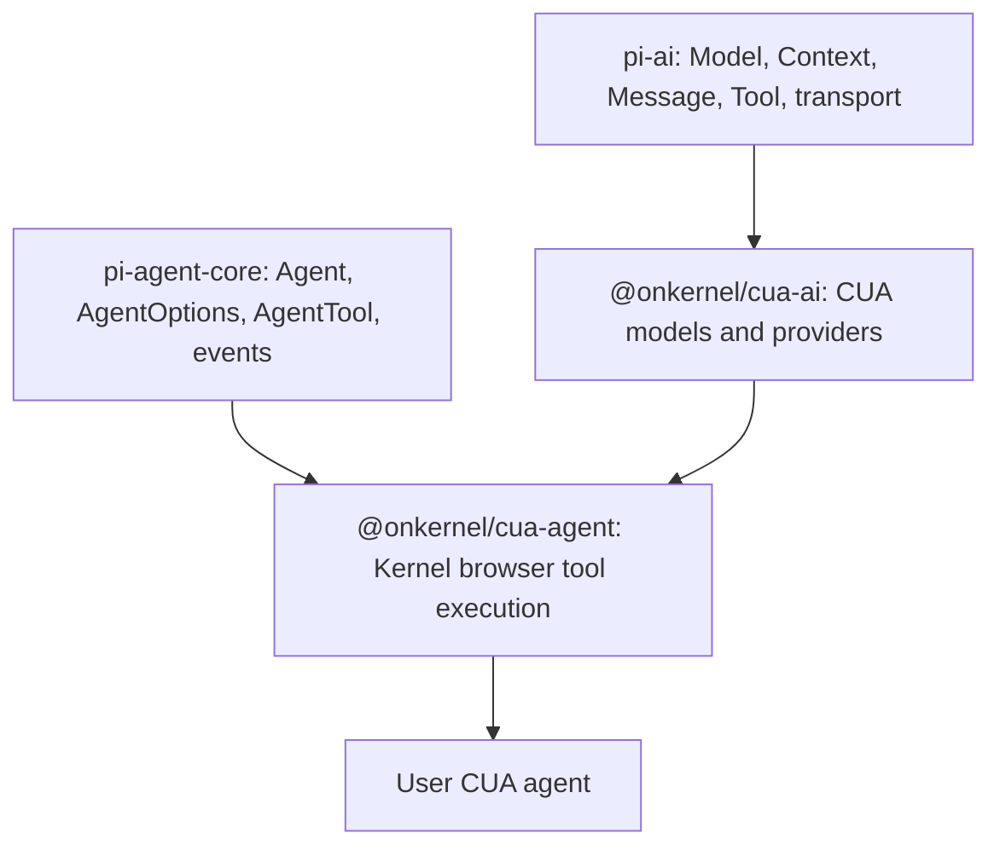

# CUA SDK Design

This document captures the evergreen product principles for Kernel's
computer-use SDK packages.

## Package The Boring Plumbing

Kernel packages should make the common browser-control work disappear:

- Kernel browser session wiring
- screenshots and screenshot reinjection
- coordinate normalization
- provider-specific computer tool schemas
- tool execution against Kernel browser APIs
- provider registration
- context and payload quirks
- sensible default prompts

These details are common to most CUA agents and are easy to get subtly wrong.

## Do Not Over-Own The Agent

Kernel should not hide the agent architecture from users. Builders should keep
control over:

- system prompts
- context and memory strategy
- custom tools
- streaming UI
- orchestration policy
- transport hooks and payload inspection

The SDK should make the default path pleasant while keeping pi's primitives
visible and replaceable.

## Layering

`@onkernel/cua-ai` is the direct model-call layer. It is for calling
CUA-capable providers and working with pi-ai contexts, messages, and tools.

`@onkernel/cua-agent` is the optional stateful loop layer. It adds Kernel
browser execution and returns a pi-agent-core `Agent`.

## Keep Model Refs Explicit

CUA model refs should be provider-qualified, for example
`openai:gpt-5.5` or `yutori:n1.5-latest`. This keeps examples, logs,
persisted config, and transcripts unambiguous. The SDK should not export a
default CUA model.

## Follow-up Direction

The current additive packages are intended to become the public SDK surface.
The expected follow-up work is:

- migrate `@onkernel/cua-cli` to consume `@onkernel/cua-ai` and
  `@onkernel/cua-agent`
- remove the old provider-specific packages
- remove the old translator package once the new internal translator fully
  covers the needed behavior
