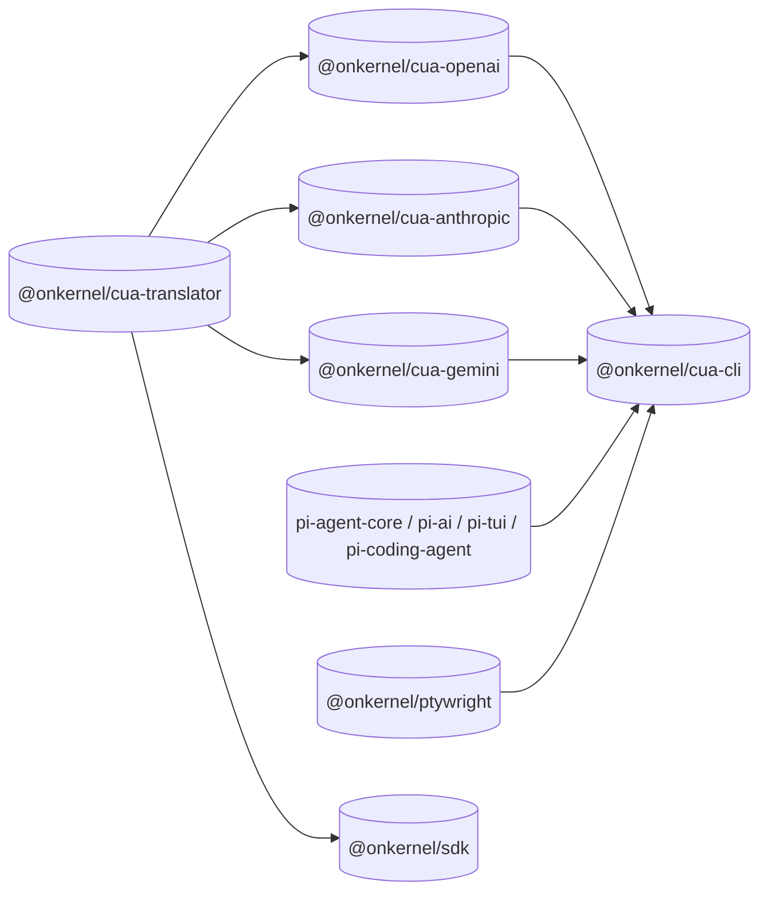
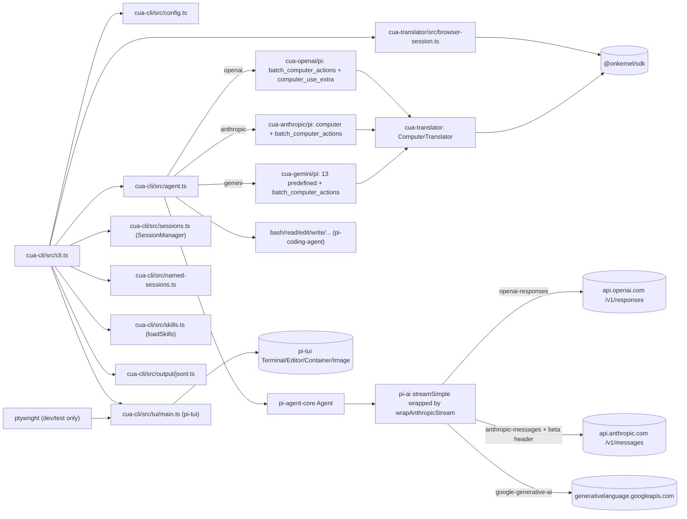

# Architecture

This document explains how `cua` is wired together. It's aimed at
someone who wants to read the code, contribute, or fork.

## Design goals and invariants

- `@onkernel/cua-agent` is provider-neutral runtime glue around
  `pi-agent-core`. It should never branch on provider identity directly.
  Provider-specific behavior must come from `@onkernel/cua-ai`.
- Provider packages are generic glue between a model provider and Kernel
  browsers. Their package roots expose provider-neutral helpers, tool
  specs, and execution functions that can be embedded in non-`pi` loops.
- `pi-agent-core` integrations live behind explicit `/pi` subpaths:
  `@onkernel/cua-openai/pi`, `@onkernel/cua-anthropic/pi`, and
  `@onkernel/cua-gemini/pi`. Keep `AgentTool`, `pi-ai`, payload-hook,
  and stream-wrapper compatibility code out of the package roots.
- `@onkernel/cua-translator` owns the canonical `ModelAction[]`
  vocabulary and the Kernel SDK execution path. Provider packages adapt
  provider-native action shapes into that vocabulary before dispatch.
- `@onkernel/cua-cli` should get provider-specific behavior only by
  depending on `@onkernel/cua-translator` and the relevant
  `@onkernel/cua-<provider>` package. Provider packages should expose
  relatively consistent root and `/pi` APIs so CLI wiring stays
  provider-shaped, not provider-special-cased.
- `@onkernel/cua-cli` owns orchestration: config, model routing,
  provider `/pi` bindings, coding tools, skills, sessions, output modes,
  and the TUI. It should compose providers, not define their wire
  schemas.
- `@onkernel/ptywright` is development/test infrastructure for terminal
  and TUI regression tests. It is part of the monorepo build graph, but
  not part of the runtime browser/model/provider path.

## `cua-ai` vs `cua-agent` ownership boundary

`@onkernel/cua-ai` and `@onkernel/cua-agent` intentionally split concerns:

- `@onkernel/cua-ai` owns provider-specific policy:
  - provider model refs and provider resolution
  - provider default system prompts
  - provider payload transforms and protocol quirks (for example, Yutori tool serialization policy)
  - canonical CUA tool-definition exports
- `@onkernel/cua-agent` owns browser execution orchestration:
  - `CuaAgent` / `CuaAgentHarness` class wiring around `@earendil-works/pi-agent-core`
  - executing canonical CUA tool calls against Kernel browsers
  - typed executor coverage and translator integration

The boundary is a single data seam. Every provider difference arrives in
`@onkernel/cua-agent` as data through `CuaRuntimeSpec` — `toolDefinitions`,
`toolExecutors`, `defaultSystemPrompt`, `coordinateSystem`, `screenshot`, and
`onPayload` — resolved per model by `resolveCuaRuntimeSpec()`. In the other
direction, the agent supplies capabilities back to provider middleware through
`CuaPayloadContext` (`keepToolNames`, `getScreenshot`): the provider hook
decides *whether and how* to use a capability (policy), the agent decides
*how it is performed* against the Kernel browser (mechanism).

The invariant: `packages/agent/src` contains no provider names and no
provider conditionals. A new provider difference is a new or extended
`CuaRuntimeSpec`/`CuaPayloadContext` field plus provider code in
`@onkernel/cua-ai` — never a branch in `@onkernel/cua-agent`. The grep test
is literal: searching agent `src/` for a provider name should only ever hit
doc comments.

One deliberate exception to "push it upstream": generic model imprecision.
Models of every provider are loose about things like key naming
(`ctrl`/`cmd`/`ArrowLeft`/word-form punctuation), so the agent-side
translator absorbs that nondeterminism when mapping canonical actions to
Kernel's X11 key vocabulary. That is corrective plumbing for model output in
general, not provider policy, and it stays in `@onkernel/cua-agent`.

## Layers

`cua` is a thin TypeScript monorepo on top of the
[pi monorepo](https://github.com/earendil-works/pi):

```text
@onkernel/cua-cli (the binary)
├── @onkernel/cua-openai          (root = generic; /pi = pi-agent-core bindings)
├── @onkernel/cua-anthropic       (root = generic; /pi = pi-agent-core bindings)
├── @onkernel/cua-gemini          (root = generic; /pi = pi-agent-core bindings)
└── @onkernel/cua-translator      (the only package that talks to @onkernel/sdk directly)

Dev/test:
└── @onkernel/ptywright           (PTY-backed TUI regression harness)

External:
├── @earendil-works/pi-agent-core   # Agent loop, tool execution, streaming, steering
│   └── @earendil-works/pi-ai       # Provider transport (OpenAI Responses, Anthropic Messages, Google GenAI)
├── @earendil-works/pi-coding-agent # bash / read / write / edit / grep / find / ls AgentTools + SessionManager + skills
├── @earendil-works/pi-tui          # Terminal, Editor, Image, differential renderer
├── openai / @anthropic-ai/sdk / @google/genai  # provider SDKs for the provider-root single-invocation helpers
└── @onkernel/sdk                 # Kernel cloud browser API
```



`tsc -b` from the repo root builds packages in dependency order via
TypeScript project references, including `@onkernel/ptywright` before
`@onkernel/cua-cli`. `npm install` symlinks workspace packages so each
package's `@onkernel/cua-*` import resolves to the local `dist/`.
The root `npm run build` also runs `@onkernel/ptywright`'s native
Ghostty-backed addon build when present.

## Per-package responsibilities

### `@onkernel/cua-translator`

The provider-agnostic core. Everything else depends on it; it depends
only on `@onkernel/sdk`.

- `types.ts` — `ModelAction`, `BatchAction*`, `BatchExecutionResult`,
  `ActionValidationError`, `ALLOWED_MODEL_ACTION_TYPES`.
- `keysym.ts` — X11 keysym map + `splitKeypress`.
- `scroll.ts` — `modelScrollDeltaToWheelTicks`,
  `wheelTicksFromAmount`.
- `cua-extras.ts` — the cua-added action builders that all providers
  share: `gotoBatchActions`, `backBatchActions`, `forwardBatchActions`,
  `currentUrlCopyActions`, plus ModelAction constructors. Clearly
  labeled as "cua extension, not in any provider's official set".
- `translator.ts` — `ComputerTranslator` (executeBatch w/ read
  coalescing, screenshotRaw/Base64, currentUrl), `translateToBatchAction`,
  `toSdkAction`.
- `browser-session.ts` — `open()` for Kernel cloud browsers (with
  optional profile lookup/create-if-missing).
- `computer-use.ts` — provider-neutral `ComputerUseModel` interface +
  single-invocation `runComputerUse()` helper for non-`pi` consumers.

The translator accepts a canonical `ModelAction[]`. Provider adapter
packages map their model's own action shape to `ModelAction` before
calling `executeBatch`.

### `@onkernel/cua-openai`

OpenAI adapter.

- Package root is provider-neutral: `openai(modelId)`, tool specs,
  execution helpers, official action schemas, and prompt constants.
- `/pi` subpath owns `pi-agent-core` bindings:
  `createOpenAIComputerTools`.
- `official.ts` — TypeBox schemas + types for OpenAI's official 9
  computer actions (`click`, `double_click`, `scroll`, `type`, `wait`,
  `keypress`, `drag`, `move`, `screenshot`) with the optional `keys`
  modifier array. Cites
  [platform.openai.com/docs/guides/tools-computer-use](https://platform.openai.com/docs/guides/tools-computer-use).
- `cua-extras.ts` — schema entries for the cua-added actions
  (`goto`, `back`, `forward`, `url`).
- `batch.ts` / `extra.ts` — root, provider-neutral tool specs +
  execution helpers for `batch_computer_actions` and
  `computer_use_extra`.
- `model.ts` — root `openai(modelId)` factory for single-invocation
  `runComputerUse()` calls.
- `system-prompt.ts` — prompt constants for both the root model path and
  the `/pi` custom-tool path.
- `pi/index.ts` — `pi-agent-core` bindings: `createOpenAIComputerTools`.

### `@onkernel/cua-anthropic`

Anthropic Claude adapter.

- Package root is provider-neutral: `anthropic(modelId)`, built-in
  computer/batch execution helpers, tool specs, and prompt builders.
- `/pi` subpath owns `pi-agent-core` bindings and transport glue:
  `createAnthropicComputerTools`, `anthropicComputerOnPayload`,
  `composeOnPayload`, `wrapAnthropicStream`, and
  `registerAnthropicProvider`.
- `official.ts` — action types for `computer_20241022`,
  `computer_20250124`, `computer_20251124` plus `ANTHROPIC_COMPUTER_TOOL`
  spec const + `ANTHROPIC_COMPUTER_USE_BETA` header value. Cites
  [docs.claude.com/en/docs/agents-and-tools/computer-use](https://docs.claude.com/en/docs/agents-and-tools/computer-use).
- `cua-extras.ts` — `ANTHROPIC_CUA_EXTRA_ACTION_TYPES` (`goto`,
  `back`, `forward`, `url`) for the batch tool.
- `computer.ts` / `batch.ts` — root, provider-neutral execution helpers
  for Anthropic's built-in `computer` tool plus cua's
  `batch_computer_actions`.
- `model.ts` — root `anthropic(modelId)` factory for single-invocation
  `runComputerUse()` calls.
- `stream-wrapper.ts` / `payload-hook.ts` — `pi`-specific transport glue
  used only from `@onkernel/cua-anthropic/pi`.
- `system-prompt.ts` — `ANTHROPIC_COMPUTER_INSTRUCTIONS` +
  `ANTHROPIC_BATCH_INSTRUCTIONS`, joinable via
  `buildAnthropicSystemPrompt`.
- `pi/index.ts` — `pi-agent-core` bindings:
  `createAnthropicComputerTools`, payload hooks, stream wrapper.

### `@onkernel/cua-gemini`

Google Gemini adapter.

- Package root is provider-neutral: `gemini(modelId)`, Gemini function
  declarations, execution helpers, coordinate helpers, and prompt
  builders.
- `/pi` subpath owns `pi-agent-core` bindings:
  `createGeminiComputerTools`.
- `official.ts` — `GeminiAction` enum +
  `PREDEFINED_COMPUTER_USE_FUNCTIONS` + `GeminiFunctionArgs`. Cites
  [ai.google.dev/gemini-api/docs/computer-use](https://ai.google.dev/gemini-api/docs/computer-use).
- `coords.ts` — `denormalizeX` / `denormalizeY` (0-1000 → pixels
  using the configured screen size).
- `cua-extras.ts` — `GEMINI_CUA_EXTRA_ACTION_TYPES` (only `url` —
  Gemini's predefined set already covers `goto`/`back`/`forward`).
- `computer.ts` — root Gemini function declarations +
  `executeGeminiFunctionCall()` for provider-neutral loops.
- `batch.ts` — root `batch_computer_actions` declaration +
  execution helper.
- `model.ts` — root `gemini(modelId)` factory for single-invocation
  `runComputerUse()` calls.
- `computer-tool.ts` / `batch-tool.ts` — `pi-agent-core` bindings kept
  behind the `/pi` subpath.
- `batch.ts` uses **pixel coordinates** (NOT Gemini's 0-1000
  convention); the system prompt explicitly highlights this distinction.
- `system-prompt.ts` — `GEMINI_COMPUTER_INSTRUCTIONS` +
  `GEMINI_BATCH_INSTRUCTIONS`, joinable via
  `buildGeminiSystemPrompt`.
- `pi/index.ts` — `pi-agent-core` bindings: `createGeminiComputerTools`.

### `@onkernel/cua-cli`

The `cua` binary itself. Wires the four packages above into a
`pi-agent-core` agent with a `pi-tui` interactive front-end.

- `cli.ts` — argv parsing, mode dispatch.
- `config.ts` — TOML loader (OpenAI + Anthropic + Gemini + Kernel,
  per-provider/per-model knobs).
- `agent.ts` — provider routing + agent factory. Resolves the
  provider from the model id, picks the right tool set + system prompt
  + payload hook + `streamFn` wrapper per model. This package owns the
  full `pi-agent-core` loop and imports the explicit `/pi` bindings from
  each provider package.
- `agent-prompt.ts` — initial-screenshot wrapping for the first user
  turn.
- `sessions.ts` — transcript persistence / replay via `SessionManager`
  plus `cua-browser` custom entries.
- `named-sessions.ts` — persisted Kernel browser reuse metadata +
  liveness checks for `cua session start|stop|list|show` and `-s <name>`.
- `skills.ts` — skill discovery + `/skill:<name>` expansion.
- `action/` — constrained one-shot prompts + bounded runner for `cua
  open|click|type|press|observe|url|do`.
- `output/jsonl.ts` — JSONL event sink for `-o jsonl`.
- `tui/` — pi-tui Terminal + Editor + container layout, screenshot
  widget, status line, capabilities banner, message list.

### `@onkernel/ptywright`

PTY-backed TUI regression harness used by `@onkernel/cua-cli` tests.
It is a workspace package and `cua-cli` dev dependency, not a runtime
browser or provider adapter.

- `terminal.ts` — in-memory Ghostty VT parser wrapper for rendered
  terminal snapshots.
- `session.ts` — PTY child-process driver for end-to-end TUI/CLI tests.
- `keys.ts` — key helpers for driving terminal sessions.
- `native-loader.ts` — loads the native Ghostty-backed addon.
- `scripts/build-ghostty.mjs` — downloads, verifies, and builds the
  pinned Ghostty `libghostty-vt` source used by the native addon.

## The canonical `batch_computer_actions` action union

The user-facing reason to put `batch_computer_actions` on every
provider: predictable multi-action sequences in one round-trip, with
optional inline reads. The architectural reason: it lets us define a
SINGLE canonical action union (in
[`@onkernel/cua-translator/src/types.ts`](../packages/cua-translator/src/types.ts))
and re-emit it in each provider's tool-spec format:

| Provider     | Tool-spec shape                                                                              |
| ------------ | -------------------------------------------------------------------------------------------- |
| OpenAI       | `{type: "function", name: "batch_computer_actions", parameters: {...}}` (Responses API)      |
| Anthropic    | `{name: "batch_computer_actions", description: "...", input_schema: {...}}` (Messages API)   |
| Gemini       | `{name: "batch_computer_actions", description: "...", parameters: {...}}` (FunctionDeclaration) |

The action type enum is the same in all three: `click`, `double_click`,
`type`, `keypress`, `scroll`, `move`, `drag`, `wait`, `screenshot` plus
the cua extensions `goto`, `back`, `forward`, `url`. Anthropic also
includes `triple_click` (mapped to 3× click before translator
dispatch).

The execution path is identical across providers:

```
batch_computer_actions args
  └─► AgentTool.execute()
        └─► translator.executeBatch(actions)
              ├─► coalesce consecutive write actions
              ├─► flush via client.browsers.computer.batch
              ├─► inline url() → readClipboard
              └─► inline screenshot() → captureScreenshot
        └─► return { content: [text, image, url, image, ...], details }
              └─► fed back to model as tool result
```

To gate the batch tool out for any single provider:

```typescript
import { createOpenAIComputerTools } from "@onkernel/cua-openai/pi";
import { createAnthropicComputerTools } from "@onkernel/cua-anthropic/pi";
import { createGeminiComputerTools } from "@onkernel/cua-gemini/pi";

createOpenAIComputerTools(translator, { includeBatch: false });
createAnthropicComputerTools(translator, { includeBatch: false });
createGeminiComputerTools(translator, { includeBatch: false });
```

## Single-invocation Root API Flow

Non-`pi` consumers bypass `cua-cli` entirely and wire the provider-root
packages straight into `runComputerUse()`:

```text
runComputerUse({ model: openai(...) | anthropic(...) | gemini(...), browser })
  └─► provider-root model factory
        ├─► OpenAI root: native {type:"computer"} tool
        ├─► Anthropic root: built-in computer_20251124 tool (+ optional batch)
        └─► Gemini root: predefined functionDeclarations (+ optional batch)
              └─► provider SDK loop
                    └─► provider execution helper
                          └─► translator.executeBatch(...)
```

This is separate from the `cua-cli` runtime: the root helpers are
bounded, single-invocation loops, while `cua-cli` continues to own the
full `pi-agent-core` agent/session/TUI workflow.

## Per-turn flow

```text
user prompt
  └─► /skill:<name> expansion (if matched)
        └─► agent.prompt({role:"user", content:[text, image?]})
              ├─► (first turn only, fresh transcript) attach a Kernel screenshot
              └─► pi-agent-core agentLoop
                    ├─► onPayload hook (chained per-provider)
                    │     ├─► OpenAI:    inject context_management compaction (if configured)
                    │     ├─► Anthropic: replace function-tool entry "computer" with computer_20251124 spec
                    │     └─► Gemini:    no-op
                    ├─► streamFn wrapper
                    │     ├─► Anthropic: merge "anthropic-beta: computer-use-2025-11-24" into headers
                    │     └─► all:       delegate to pi-ai's streamSimple
                    └─► provider HTTP SSE (api.openai.com / api.anthropic.com / generativelanguage.googleapis.com)
                          ├─► tool calls
                          │     ├─► OpenAI:    batch_computer_actions / computer_use_extra
                          │     ├─► Anthropic: computer (built-in) + batch_computer_actions
                          │     └─► Gemini:    13 predefined functions + batch_computer_actions
                          │     └─► AgentTool.execute → translator.executeBatch
                          │           ├─► coalesce writes; flush via client.browsers.computer.batch
                          │           ├─► inline url() → readClipboard
                          │           └─► inline screenshot() → captureScreenshot
                          └─► assistant text deltas → TUI / stdout / JSONL
```

The seam is in `packages/cua-cli/src/agent.ts:createCuaAgent`, which:

1. Resolves the provider from the exact supported model table in
   `packages/cua-cli/src/models.ts`.
2. Loads the `Model<Api>` from `pi-ai`'s registry when present, or from
   CUA's conservative dynamic fallback while `pi-ai` catches up to new
   provider model IDs.
3. Builds the per-provider tool list via the explicit `/pi` bindings:
   `@onkernel/cua-openai/pi`,
   `@onkernel/cua-anthropic/pi`,
   `@onkernel/cua-gemini/pi`.
4. Builds the per-provider system prompt from the matching
   `*_BATCH_INSTRUCTIONS` / `buildAnthropicSystemPrompt` /
   `buildGeminiSystemPrompt` exports + `appendSkillsToSystemPrompt`.
5. Composes the per-provider `onPayload` hooks and wraps `streamSimple`
   with `wrapAnthropicStream`.

That seam is intentionally `pi`-specific. Consumers that do not want the
`pi-agent-core` loop should use package-root helpers such as
`openai(...)`, `anthropic(...)`, or `gemini(...)` with
`runComputerUse()` instead of importing from `/pi`.

## Component map



## Provider-specific gotchas

### OpenAI: root native path vs `/pi` compatibility path

The repo now has two OpenAI integration paths:

1. The provider-root path (`openai(modelId)` + `runComputerUse()`)
   uses OpenAI's native `{type:"computer"}` tool through the official
   OpenAI SDK.
2. The `@onkernel/cua-openai/pi` path used by `cua-cli` keeps the
   custom `batch_computer_actions` / `computer_use_extra` tools.

Why keep the custom tools on the `/pi` path? Because `pi-ai`'s OpenAI
Responses provider only emits `type:"function"` tool specs
(`convertResponsesTools`) and only handles `reasoning` / `message` /
`function_call` output items (`processResponsesStream`). A
`computer_call` item from the model would be silently dropped. To
support the built-in `{type:"computer"}` inside `pi-agent-core`, we'd
need to fork or replace pi-ai's response parser.

So the current split is intentional:

- provider root: prefer the native OpenAI computer tool.
- `/pi` binding: prefer `batch_computer_actions` (more expressive in the
  current `pi-ai` transport) plus `computer_use_extra` for one-shot
  `goto` / `back` / `url`.

### Anthropic claude-opus-4-7: built-in tool injection

Anthropic's built-in `computer_20251124` tool emits standard `tool_use`
blocks — pi-ai parses those natively. The trick is that pi-ai's tool
serialization expects function tools (`name` + `input_schema`), not
Anthropic's special built-in tool spec
(`{type: "computer_20251124", name: "computer", display_width_px,
display_height_px, ...}`).

We work around it with two pieces:

1. Register a "computer" `AgentTool` with a permissive schema so
   pi-agent-core knows how to route incoming `tool_use` blocks named
   `computer` to our `execute()`.
2. An `onPayload` hook (`anthropicComputerOnPayload`) rewrites the
   wire payload's `tools[]` array, replacing the function-tool entry
   for "computer" with the built-in `computer_20251124` spec.

The required beta header (`anthropic-beta: computer-use-2025-11-24`)
is merged in by `wrapAnthropicStream` (alongside whatever beta tokens
pi-ai is already sending for fine-grained tool streaming).

### Gemini: per-action tools via `functionDeclarations`

For Gemini we send the predefined computer-use functions as ordinary
`functionDeclarations` (with the trained-name `name` field) plus our
cua-added `batch_computer_actions` declaration in the same tool list.

That keeps Gemini's trained function names (`click_at`, `type_text_at`,
`navigate`, …) while still letting us expose custom batching behavior in
the same request.

## Out of scope (today)

| Feature                                            | Status   | Notes                                                                 |
| -------------------------------------------------- | -------- | --------------------------------------------------------------------- |
| Anthropic `hold_key` / `left_mouse_down`/`up` / `zoom` | deferred | AgentTool returns `is_error` so the model adapts                      |
| `--local` Docker-backed browser                    | deferred | Remote cloud only                                                     |
| pi-tui `SelectList`-based session picker for `-r`  | deferred | Plain readline picker today                                           |
| Publishing `@onkernel/cua-*` to npm                | deferred | Package boundaries are stable; `0.1.0` versions ready                 |

Each is a small follow-up given the architecture is already in place.
