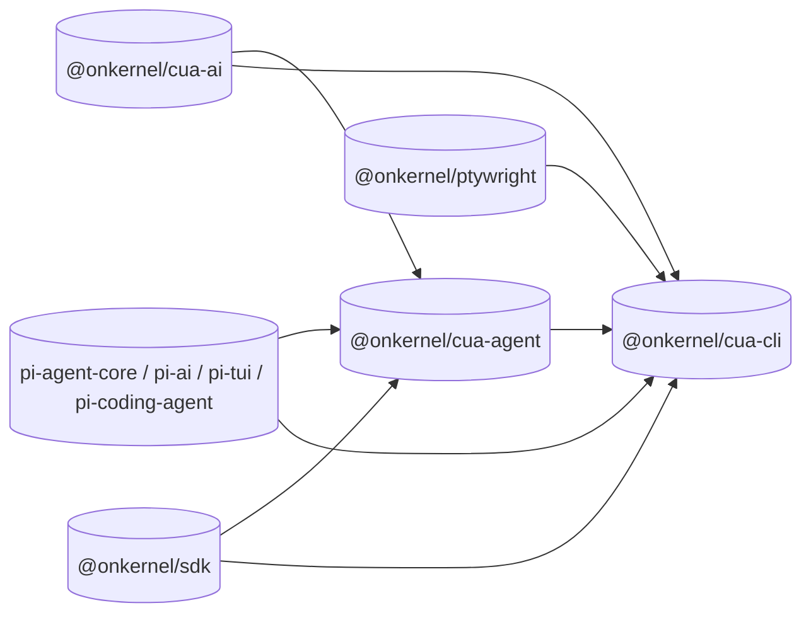
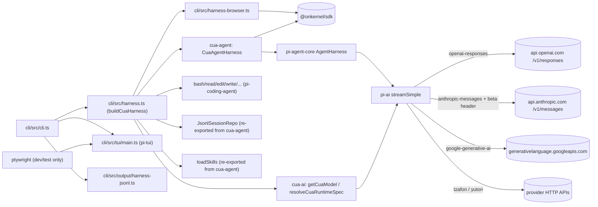

# Architecture

This document explains how `cua` is wired together. It's aimed at
someone who wants to read the code, contribute, or fork.

## Design goals and invariants

- `@onkernel/cua-ai` owns provider-specific policy: the curated
  computer-use model catalog, canonical CUA tool-call schemas, provider
  default system prompts, and provider payload transforms / protocol
  quirks.
- `@onkernel/cua-agent` is provider-neutral runtime glue around
  `pi-agent-core`'s `Agent` / `AgentHarness`. It executes canonical CUA
  tool calls against Kernel cloud browsers via `@onkernel/sdk` and never
  branches on provider identity — every provider difference arrives as
  data through `CuaRuntimeSpec`.
- `@onkernel/cua-cli` owns orchestration: argv parsing, env-var-based
  auth, session and skill resolution, JSONL/plain-text output, and the
  pi-tui interactive front-end. It composes `CuaAgentHarness` from
  cua-agent and the model catalog from cua-ai.
- `@onkernel/ptywright` is development/test infrastructure for terminal
  and TUI regression tests. It is part of the monorepo build graph, but
  not part of the runtime browser/model path.

## `cua-ai` vs `cua-agent` ownership boundary

`@onkernel/cua-ai` and `@onkernel/cua-agent` intentionally split concerns:

- `@onkernel/cua-ai` owns provider-specific policy:
  - provider model refs and provider resolution
  - provider default system prompts
  - provider payload transforms and protocol quirks
  - canonical CUA tool-definition exports
- `@onkernel/cua-agent` owns browser execution orchestration:
  - `CuaAgent` / `CuaAgentHarness` wiring around
    `@earendil-works/pi-agent-core`
  - executing canonical CUA tool calls against Kernel browsers
  - typed executor coverage and screenshot handling

The boundary is a single data seam. Every provider difference arrives in
`@onkernel/cua-agent` as data through `CuaRuntimeSpec` — `toolDefinitions`,
`toolExecutors`, `defaultSystemPrompt`, `coordinateSystem`, `screenshot`, and
`onPayload` — resolved per model by `resolveCuaRuntimeSpec()`. In the other
direction, the agent supplies capabilities back to provider middleware through
`CuaPayloadContext` (`keepToolNames`, `getScreenshot`): the provider hook
decides *whether and how* to use a capability (policy), the agent decides
*how it is performed* against the Kernel browser (mechanism).

The invariant: `packages/agent/src` contains no provider names and no
provider conditionals. A new provider difference is a new or extended
`CuaRuntimeSpec`/`CuaPayloadContext` field plus provider code in
`@onkernel/cua-ai` — never a branch in `@onkernel/cua-agent`.

## Layers

`cua` is a thin TypeScript monorepo on top of the
[pi monorepo](https://github.com/earendil-works/pi):

```text
@onkernel/cua-cli (the binary)
├── @onkernel/cua-agent      (CuaAgent/CuaAgentHarness; pi-agent-core wrapper)
│   └── @onkernel/cua-ai     (model catalog, tool schemas, provider adapters)
└── @onkernel/cua-ai         (also depended on directly for the model catalog)

Dev/test:
└── @onkernel/ptywright      (PTY-backed TUI regression harness)

External:
├── @earendil-works/pi-agent-core   # Agent loop, tool execution, streaming, steering
│   └── @earendil-works/pi-ai       # Provider transport (OpenAI Responses, Anthropic Messages, Google GenAI, Tzafon, Yutori)
├── @earendil-works/pi-coding-agent # bash / read / write / edit / grep / find / ls AgentTools
├── @earendil-works/pi-tui          # Terminal, Editor, Image, differential renderer
└── @onkernel/sdk                   # Kernel cloud browser API
```



`tsc -b` from the repo root builds packages in dependency order via
TypeScript project references. `npm install` symlinks workspace packages
so each package's `@onkernel/cua-*` import resolves to the local `dist/`.
The root `npm run build` also runs `@onkernel/ptywright`'s native
Ghostty-backed addon build when present.

## Per-package responsibilities

### `@onkernel/cua-ai`

The model layer. Curates the supported computer-use model catalog and
the canonical CUA tool-call schemas every provider conforms to.

- `getCuaModel(ref)` / `listCuaModels()` / `parseCuaModelRef(ref)` /
  `CuaModelRef` — catalog lookup keyed on `provider:model` refs.
- `resolveCuaRuntimeSpec(model)` — returns the `CuaRuntimeSpec`
  consumed by `@onkernel/cua-agent`: `toolDefinitions`, `toolExecutors`,
  `defaultSystemPrompt`, `coordinateSystem`, `screenshot`, `onPayload`.
- Provider adapters on top of `pi-ai` for OpenAI, Anthropic, Google,
  Tzafon, and Yutori — including each provider's payload transforms and
  protocol quirks (Anthropic computer-use beta header, Gemini 0-1000
  coord denormalization, …).
- API-key env-var conventions:
  `cuaApiKeyEnvVarsForProvider(provider)`, `getCuaEnvApiKey(provider)`,
  `requireCuaEnvApiKey(provider)`, plus the `…ForModel(refOrModel)`
  variants.

### `@onkernel/cua-agent`

The execution layer. Wraps `pi-agent-core` with Kernel-browser plumbing
for canonical CUA tools.

- `CuaAgent` — direct `pi-agent-core` `Agent` integration for bounded
  loops and raw message-state access.
- `CuaAgentHarness` — `pi-agent-core` `AgentHarness` integration with
  session-backed transcripts (`prompt`, `subscribe`, `compact`,
  `setModel`, `followUp`, `steer`, …).
- Re-exports the full `pi-agent-core` 0.79 surface that consumers (like
  `cua-cli`) need: `JsonlSessionRepo`, `Session`, `loadSkills`,
  `loadPromptTemplates`, `formatSkillsForSystemPrompt`,
  `compact()` / `shouldCompact` / `estimateContextTokens`,
  `NodeExecutionEnv`, and harness event types.
- Executes canonical CUA tool calls (the `CuaAction` vocabulary) against
  the Kernel SDK: coalesces consecutive write actions, dispatches via
  `client.browsers.computer.batch`, and captures fresh screenshots via
  `client.browsers.computer.captureScreenshot` for the model to see.

### `@onkernel/cua-cli`

The `cua` binary itself. Composes a `CuaAgentHarness` from argv flags,
env-var-based API keys, a `JsonlSessionRepo`, pi skills, and the pi
coding tools, then renders the result to text, JSONL, or pi-tui.

- `cli.ts` — argv parsing, mode dispatch.
- `cli-harness.ts` — shared dispatch layer behind `cli.ts`; exports
  `runModelsSubcommand`, `runSessionSubcommand`,
  `runPrintCommand`, `runActionCommand`, and `runInteractiveCommand`.
  The harness-driven entry points share `setupHarnessRuntime`, which
  resolves the model, browser, session, and skills before calling
  `buildCuaHarness` and routing into `print.ts`, `action/`, or
  `tui/main.ts`.
- `harness.ts` — `buildCuaHarness(opts)`: one assembly function that
  produces the `CuaAgentHarness` shared by `--print`, action
  subcommands, and the interactive TUI.
- `harness-browser.ts` — Kernel SDK browser lifecycle
  (`client.browsers.create`/`retrieve`/`deleteByID`) with optional
  named-profile load/save.
- `harness-models.ts` — `-m` / `--model` resolution over
  `listCuaModels()`; `cua models` printer over the same catalog.
- `harness-sessions.ts` — `JsonlSessionRepo` wiring for `--continue`,
  `--resume`, `--session <ref>`, and the `cua-browser` custom entry.
- `harness-named-sessions.ts` — persisted Kernel browser metadata for
  `cua session start|stop|list|show` and `-s <name>`.
- `harness-skills.ts` — pi `loadSkills` over `~/.agents/skills`,
  `<cwd>/.agents/skills`, and `--skill <path>`; `/skill:<name>`
  expansion.
- `action/` — constrained one-shot prompts (`open|click|type|press|observe|url|screenshot|do`)
  and a bounded harness-driven runner.
- `print.ts` — single-shot `--print` text output.
- `output/harness-jsonl.ts` — JSONL event sink for `-o jsonl`.
- `tui/` — pi-tui 0.79 interactive front-end: `Markdown` message list,
  `Image` screenshot widget, status line, telemetry footer, `Editor`
  with autocomplete-backed slash commands (`/model`, `/thinking`,
  `/compact`, `/skill:<name>`).

### `@onkernel/ptywright`

PTY-backed TUI regression harness used by `@onkernel/cua-cli` tests.
It is a workspace package and `cua-cli` dev dependency, not a runtime
browser or provider adapter.

- `terminal.ts` — in-memory Ghostty VT parser wrapper for rendered
  terminal snapshots.
- `session.ts` — PTY child-process driver for end-to-end TUI/CLI tests.
- `keys.ts` — key helpers for driving terminal sessions.
- `native-loader.ts` — loads the native Ghostty-backed addon.
- `scripts/build-ghostty.mjs` — downloads, verifies, and builds the
  pinned Ghostty `libghostty-vt` source used by the native addon.

## Per-turn flow

```text
user prompt
  └─► /skill:<name> expansion (if matched)
        └─► harness.prompt(text, { images })
              ├─► (first turn only, fresh transcript) attach a Kernel screenshot
              └─► pi-agent-core agentLoop
                    ├─► resolveCuaRuntimeSpec(model) provides toolDefinitions,
                    │   toolExecutors, defaultSystemPrompt, onPayload, …
                    ├─► onPayload (cua-ai) — provider payload transforms
                    ├─► pi-ai streamSimple → provider HTTP SSE
                    │   (OpenAI Responses / Anthropic Messages / Google GenAI / Tzafon / Yutori)
                    ├─► tool_call events carry canonical CuaAction args
                    │   └─► cua-agent executor
                    │         ├─► coalesce writes; flush via client.browsers.computer.batch
                    │         ├─► inline url() / read actions
                    │         └─► fresh screenshot via captureScreenshot
                    └─► assistant text + harness events → TUI / stdout / JSONL
```

The CLI's `buildCuaHarness` in `packages/cli/src/harness.ts`:

1. Resolves the model via `getCuaModel(ref)` / `listCuaModels()` from
   `@onkernel/cua-ai`.
2. Wires `JsonlSessionRepo` and a `Session` for transcript persistence
   and resume.
3. Loads pi skills from `~/.agents/skills`, `<cwd>/.agents/skills`, and
   any `--skill <path>` flags and exposes them via `resources.skills`.
4. Provides `extraTools` from `createCodingTools(cwd)`
   (`@earendil-works/pi-coding-agent`) for bash/read/edit/write/grep/find/ls.
5. Resolves the API key via `requireCuaEnvApiKeyForModel(ref)` and
   spreads any `<PROVIDER>_BASE_URL` env override onto the model object.
6. Composes the `systemPrompt` callback from
   `resolveCuaRuntimeSpec(model).defaultSystemPrompt` plus
   `formatSkillsForSystemPrompt(resources.skills)` so it stays correct
   across `setModel()`.

## Component map



## Out of scope (today)

| Feature                                            | Status   | Notes                                             |
| -------------------------------------------------- | -------- | ------------------------------------------------- |
| Anthropic `hold_key` / `zoom`                      | deferred | Translator returns errors so the model adapts     |
| `--local` Docker-backed browser                    | deferred | Remote Kernel cloud only                          |
| pi-tui `SelectList`-based session picker for `-r`  | deferred | Plain readline picker today                       |
| Auto-compaction in the harness run loop            | deferred | Manual `/compact` from the TUI; `shouldCompact` + `estimateContextTokens` are available from cua-agent re-exports for a future auto-trigger |
