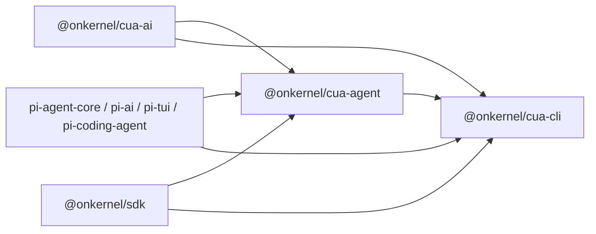

# Architecture

This document explains how `cua` is wired together for contributors and
integrators.

## Product principles

Kernel packages own the repetitive browser plumbing: browser-session wiring,
provider payload quirks, coordinate conversion, action execution, and action
feedback. They do **not** choose an agent's tools or system prompt. Callers own
both explicitly and may use pi's orchestration primitives directly.

## Package boundaries

- `@onkernel/cua-ai` owns the model catalog, stable tool identities, tool
  factories/toolsets, provider declarations, compatibility validation, headers,
  payload transforms, and incoming native-call normalization. Catalog
  compilation is declaration-only and deterministic; the package has no
  `AgentTool` or materialization types and no `pi-agent-core` dependency.
- `@onkernel/cua-agent` is provider-neutral runtime glue around
  `pi-agent-core`. It defines `CuaAgentTool`, materializes catalog specs
  exactly once per shared resource pool against a Kernel browser, owns
  implementation identity for replacement detection, owns shared execution
  resources, and applies catalog plans supplied as data.
- `@onkernel/cua-cli` owns application policy: it chooses an explicit tool list
  for each selected model, adds pi coding tools, supplies the system prompt,
  resolves credentials/sessions/skills, and renders text, JSONL, or TUI output.
- `@onkernel/ptywright` is development-only PTY/TUI test infrastructure.
- `@onkernel/cua-pi-extension` adapts explicit CUA specs into pi extension
  tools. Pi owns model selection, sessions, prompting, and RPC; cua-ai compiles
  declarations and cua-agent executes against the shared browser pool. It also
  registers CUA's Anthropic provider wrapper so the documented native Anthropic
  computer tool retains its transport behavior.

The invariant is that `packages/agent/src` contains no provider-name branches.
Adding provider behavior means adding data and transforms in `cua-ai`, not a
conditional in `cua-agent`.


```mermaid
flowchart LR
  ai["@onkernel/cua-ai"]
  agent["@onkernel/cua-agent"]
  cli["@onkernel/cua-cli"]
  pi["pi-agent-core / pi-ai / pi-tui / pi-coding-agent"]
  sdk["@onkernel/sdk"]
  ai --> agent
  agent --> cli
  ai --> cli
  pi --> agent
  pi --> cli
  sdk --> agent
  sdk --> cli
```

## Explicit tool catalog

`cua-ai` exposes one frozen namespace:

```ts
import { cua } from "@onkernel/cua-ai";

const tools = [
  cua.tools.browser.snapshot(),
  cua.tools.browser.click(),
  cua.tools.computer.screenshot(),
];
```

The main groups are:

- `cua.tools.browser.*`: CDP/page tools, using element refs and viewport pixels.
- `cua.tools.computer.*`: Kernel OS input/read tools, using pixel coordinates by
  default.
- `cua.tools.playwright()`: a Playwright code execution tool.
- `cua.toolsets.browser()`, `computer()`, and `mixed()`: ordinary convenience
  arrays of CUA-authored tools.
- `cua.providers.*`: only provider-native tools and predefined toolsets backed
  by linked first-party documentation. Each provider namespace exposes its
  `source` (or versioned `sources`), and every returned spec carries that URL.

Each CUA-owned tool has a stable identity independent of its caller-visible
name. Compilation preserves requested order and derives provider-safe names,
schema fingerprints, coordinate contracts, loading eligibility,
headers, payload transforms, and native input mappings. Duplicate identities,
name collisions, transform conflicts, and model/tool incompatibilities fail
before a model request.

## Dynamic catalogs

`CuaAgent` and `CuaAgentHarness` use composition around pi and expose:

```ts
agent.getTools();
agent.setTools(nextTools);
agent.setModel(nextModel);
```

`setTools()` recompiles atomically before mutating pi state. Existing tool
identity with a changed schema, executor, or coordinates counts as a real
replacement. Additions made from inside a running tool are recorded in pi's
Anthropic-compatible `addedToolNames` marker only when that provider/model can
defer ordinary function tools. Additions outside a tool call are eager.
Provider-native tools are always eager.

Model changes revalidate the entire requested catalog; incompatible
combinations fail without partial mutation.

## Shared execution resources

A single `CuaExecutionResources` pool is created per agent/harness and survives
catalog and model changes. It owns:

- the Kernel client and browser handle;
- one canonical computer translator;
- one lazily created raw-CDP `BrowserExecutor`;
- browser element-ref and frame state;
- screenshot and Playwright execution capabilities.

This prevents `setTools()` from resetting refs, tabs, browser state, or caches.
Tools are materialized as small adapters over that shared pool, exactly once
per spec object.

## Action planes and result feedback

Canonical actions live under `packages/ai/src/actions/`:

- **Computer actions** use Kernel's `browsers.computer` API and OS screenshot
  coordinates.
- **Browser actions** use `packages/agent/src/translator/browser.ts` over the
  browser's raw CDP websocket. Element refs are snapshot-scoped and stale refs
  fail with a request to snapshot again.

Tools return only the result requested by the model:

- Write actions return concise success text.
- Read actions return their requested text or structured data.
- Screenshot and zoom actions return images.
- `browser_act` returns causal outcomes and a bounded successor diff.
- Failed batches replace images captured by earlier explicit screenshot steps
  with textual markers.

## Mechanical batches

`computer_batch` and `browser_batch` are bounded lists of primitive actions.
They do not contain a workflow DSL, references, branching, or saved values.

Computer batches coalesce consecutive writes into Kernel batch calls and flush
around reads so results stay ordered. Browser batches execute sequentially over
the shared `BrowserExecutor`, so refs from a snapshot can be consumed later in
the same batch. Failure stops at the first failing action and reports the failed
index, completed read results, and skipped count.

## Provider composition

Catalog compilation composes provider behavior rather than replacing the whole
catalog:

- Ordinary function tools stay ordinary.
- Anthropic native browser/computer declarations replace only their own
  placeholders and merge required beta headers with caller headers.
- OpenAI native computer uses a CUA-owned Responses adapter and can coexist with
  ordinary functions.
- Tzafon replaces only the selected computer identity and fills declaration
  dimensions from the actual viewport.
- Anthropic's native browser tool falls back to an equivalent function-tool
  declaration when the active credential cannot access `browser_20260701`;
  the selected tool identity, name, schema, and executor remain unchanged.
- Google's current predefined browser toolset serializes one `computer_use`
  declaration plus exact exclusions through the CUA-owned Interactions API
  adapter. Excluded calls fail with a named catalog error instead of reaching
  generic tool dispatch.
- Yutori emits its native `tool_set`/`disable_tools` fields while preserving
  ordinary function tools.
- Meta, xAI, and Moonshot disable parallel tool calls when the selected catalog
  can mutate browser state.

Generated payload processing has fixed order: model preparation, tool
serialization, provider fields, then the caller's `onPayload` hook.

## CLI composition

`packages/cli/src/harness.ts` is the application composition root. It:

1. resolves the provider-qualified model;
2. chooses `defaultInteractionTools(model)` explicitly:
   - CUA browser primitives plus the explicit `browser_act` verified-plan tool
     for OpenAI, Meta, xAI, and Anthropic models without native-browser support;
   - CUA browser primitives alone for Moonshot, whose API rejects
     `browser_act`'s larger schema;
   - Anthropic's native browser tool when the model supports it;
   - Google's native browser action set;
   - Tzafon's native computer tool configured for a browser;
   - Yutori's native N1 or N1.5 browser set plus an explicit screenshot tool;
3. creates and retains its own application-level coding-tool list;
4. passes the complete list to `CuaAgentHarness`;
5. builds a caller-owned prompt from loaded skills and context files;
6. uses one `Session` for transcript persistence and resume;
7. exposes `cua act '<json>'` as a model-free path to the same `browser_act`
   executor and bounded formatter used by agent tool calls.

### Interactive selectors

`packages/cli/src/tui/main.ts` mounts pickers with pi's swap-in-place pattern:
the editor lives in its own `editorContainer`, and a selector temporarily
replaces it so the status line and telemetry footer stay visible. While a
selector is mounted it owns all keyboard input; the global input listener yields
to it so `ctrl+c` cancels the selector instead of quitting.

- `tui/model-picker.ts` — searchable `/model` picker over `listCuaModels()`,
  plus the pure helpers (`modelSearchText`, `sortModelsForPicker`,
  `filterModelsForPicker`, `moveSelection`, `visibleWindow`) that make its
  behavior unit-testable without a terminal.
- `tui/tool-selection.ts` — pure `/tools` state machine: identity keys matching
  `normalizeTool`'s scheme, group badges, atomic provider groups, and
  toggle/bulk operations.
- `tui/tools-picker.ts` — the `/tools` component. Staged edits applied through
  `harness.setTools()` with a subset of the application-composed baseline, in
  baseline order.
- `tui/keybindings.ts` — registers `cua.tools.*` ids on top of pi-tui's
  `TUI_KEYBINDINGS` and formats their hints.
- `tui/mutation-queue.ts` — the serialization queue both catalog mutations run
  through.

Both catalog mutations a selector can trigger — a `/tools` apply and a `/model`
switch — run through that one queue, because each suspends across several
`setTools()`/`setModel()` calls. Without it an apply could land between a
switch's `setModel()` and its final `setTools()` and fail its compile against
the wrong provider. Selectors also refuse to open mid-turn: the agent's
execution-scope guard only covers mutation from inside a tool's `execute`, so
this TUI-side check is what protects a streaming request.

## Per-turn flow

```text
user prompt
  -> CuaAgentHarness / pi agent loop
     -> active identity-keyed catalog
     -> generated headers and payload transforms
     -> caller onPayload
     -> provider stream
     -> incoming native/function call normalization
     -> shared CuaExecutionResources
        -> Kernel computer API or raw-CDP BrowserExecutor
     -> policy-specific action result
     -> transcript + TUI/stdout/JSONL
```

## Validation and test ownership

- `packages/ai/test/tool-catalog.test.ts`: identities, collisions, provider
  composition, compatibility, declarations, and coordinate contracts.
- `packages/agent/test/resources.test.ts`: action feedback and batch boundaries.
- `packages/agent/test/agent.test.ts`: exact catalogs and dynamic replacement.
- `packages/agent/test/translator-browser.test.ts`: browser behavior and ref
  lifecycle.
- `packages/cli/test/`: explicit CLI assembly, sessions, actions, and TUI flows.
